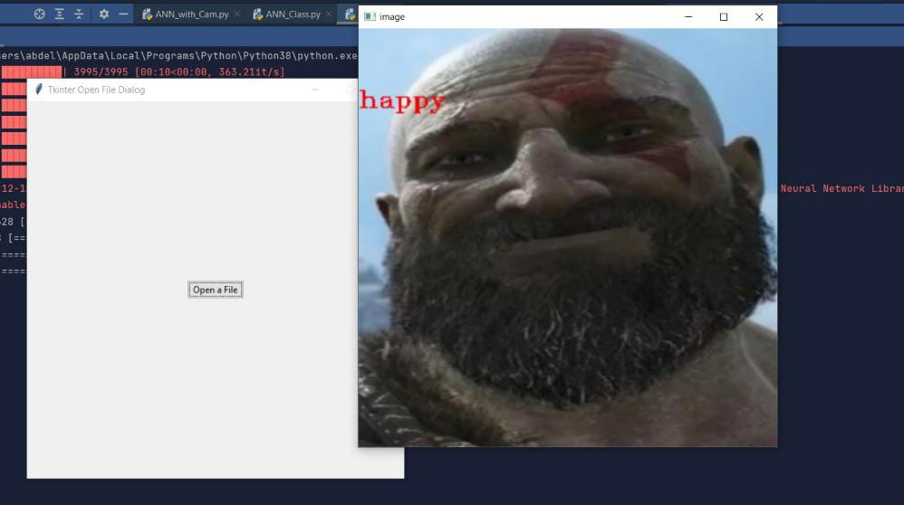

# Automated Facial Expression Recognition using Artificial Neural Networks

Facial expression recognition is the task of classifying the expressions on face images into various categories such as anger, fear, surprise, sadness, happiness and so on. Emotional facial expressions can inform researchers about an individual's emotional state.

This repository contains code for automated facial expression recognition using artificial neural networks (ANNs), specifically convolutional neural networks (CNNs). The code is written in Python using the Keras deep learning framework.

## Dataset

The code in this repository is based on the [FER2013 dataset](https://www.kaggle.com/datasets/msambare/fer2013), which contains facial expression images categorized into seven emotions: anger, disgust, fear, happiness, sadness, surprise, and neutral.

## Convolutional Neural Networks (CNNs)

CNNs are a type of artificial neural network that are commonly used for image classification tasks. They are particularly effective at recognizing spatial patterns in images, making them well-suited for facial expression recognition.

## Artificial Neural Networks (ANNs)

ANNs are a family of machine learning models inspired by the structure and function of biological neural networks. They are composed of interconnected nodes that process and transmit information, allowing them to learn complex relationships and patterns in data.

### Output

- ## Cam video:

- ## GUI:

## Getting Started

To get started with this project, you can clone this repository and run the code on your local machine. You will need to have Python and the Keras library installed.

## Usage

The code in this repository can be used to train and evaluate a CNN model for facial expression recognition on the [FER2013 dataset](https://www.kaggle.com/datasets/msambare/fer2013). The trained model can then be used to classify facial expressions in new images.

## Acknowledgments

This project was inspired by the work of researchers in the field of facial expression recognition using ANNs. The code in this repository is based on the tutorials and examples provided by the Keras library.

## References

- Facial Expression Detection using Machine Learning in Python: [Medium](https://medium.com/analytics-vidhya/facial-expression-detection-using-machine-learning-in-python-c6a188ac765f)

If you have any questions or suggestions, feel free to contact us. Thank you for visiting our repository!

© 2022 Automated Facial Expression Recognition using Artificial Neural Networks. All rights reserved.
